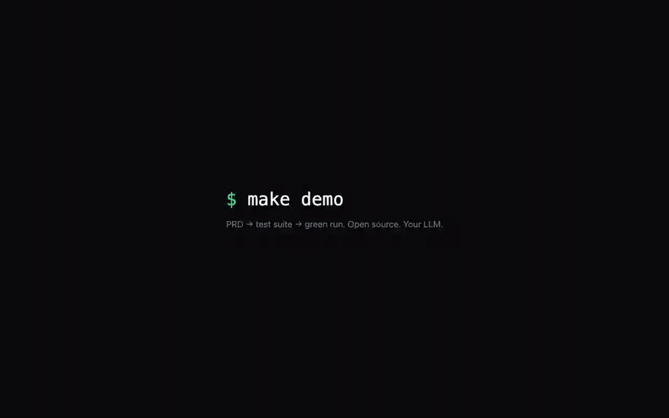

# Suitest — MCP-native testing platform

<p align="center">
  <picture>
    <source media="(prefers-color-scheme: dark)" srcset="assets/brand/logo-dark.svg">
    
  </picture>
</p>

<p align="center">
  <strong>Manual test management. Deterministic runs. Optional autonomous AI.<br>Your stack, your LLM, your data.</strong>
</p>

<p align="center">
  <a href="https://github.com/suiflex/suitest/actions/workflows/ci.yml"></a>
  <a href="https://github.com/suiflex/suitest/releases"></a>
  <a href="./LICENSE"></a>
  <a href="https://modelcontextprotocol.io"></a>
</p>

<p align="center">
  
</p>

<p align="center">
  <em>AI-generated suite (from <a href="./examples/demo-app/PRD.md">PRD.md</a>) running green against a live app — API + browser steps, screenshots included.<br>
  Replay it yourself in one command: <code>make demo</code> → <a href="http://localhost:3000">localhost:3000</a> (<code>demo@suitest.dev</code> / <code>demo1234</code>). No LLM key needed.</em>
</p>

**Suitest** is a self-hostable, open-source QA platform that works fully **without an LLM** (ZERO tier): manual test case management plus a deterministic run engine that drives any target through [MCP](https://modelcontextprotocol.io) (Playwright, HTTP APIs, Postgres, and more). If you want AI on top, plug in your own LLM key (cloud, or local Ollama) to unlock test generation, failure diagnosis, and conversational testing. No vendor lock-in, no forced API keys.

It also ships an **MCP server for IDE agents** (Claude Code, Cursor, Codex): analyze a repo, generate runnable tests, execute them with video and screenshot evidence, and publish results. Its **blackbox DOM engine** can test any web app from just a URL and test credentials, without repo access.

Backend: Python 3.12 + FastAPI · Frontend: Vite + React 19 · DB: Postgres 16 + pgvector · Queue: ARQ/Redis · Plugin layer: MCP.

[Docs](./docs) · [Getting started](#install) · [MCP server](./docs/MCP_PLUGINS.md) · [Blackbox testing](./docs/BLACKBOX_UI_TESTING.md) · [Deployment](./docs/DEPLOYMENT.md) · [Architecture](./docs/ARCHITECTURE.md) · [Troubleshooting](./docs/TROUBLESHOOTING.md) · [Contributing](./CONTRIBUTING.md)

New install? Start at [Install](#install) below. `npx @suiflex/suitest onboard` boots the full platform locally in one command; the MCP server alone runs from a single `npx` command; the team server is one `make docker-up`.

---

## Project status

**Pre-v1.0, under active development.** What works **today**:

- ✅ Manual TCM — create/edit test cases, steps, suites, projects (read + write)
- ✅ Deterministic runner via MCP — `playwright`, `api-http`, `postgres` providers
- ✅ Live run logs (WebSocket), screenshots + per-test video, MinIO artifacts, cancel/rerun
- ✅ Rule-based defects, traceability matrix, analytics, integrations + CI webhooks (GitHub/GitLab/Jira/Slack)
- ✅ Deterministic generators — OpenAPI, browser recorder, crawler
- ✅ **MCP server for IDE agents** (`npx -y @suiflex/suitest-mcp`) — analyze → generate → run → publish from Claude Code / Cursor / Codex, incl. a **blackbox DOM engine** that tests any web app from just a URL + credentials (no repo, no LLM key)
- ✅ BYO LLM per workspace (Settings → LLM: Anthropic/OpenAI/Gemini/…, local Ollama/vLLM, or any OpenAI-compatible URL) — unlocks agent chat, PRD-driven test generation, LLM codegen
- ✅ Local auth: super-admin bootstrap + invite-only onboarding (no OAuth required)

See [docs/ROADMAP.md](./docs/ROADMAP.md) — the single source of truth for build status.

---

## Install

Five supported paths.

### 1. Local bundle — one command (recommended quickstart)

Requirements: **Node ≥ 18** and [uv](https://docs.astral.sh/uv/).

```bash
npx @suiflex/suitest onboard
```

Boots the full platform locally — web dashboard + API on SQLite + run supervisor (port 4000, falls back to 4001–4009, binds `127.0.0.1`) — and wires your IDE's MCP config in the same step. No Docker, no Postgres, no LLM key (generation uses MCP sampling through your IDE agent). Data lives in `./.suitest/`; the dashboard and Suitest wheels ship inside the npm package (~3 MB). `suitest up` / `suitest down` manage the stack; `suitest settings` generates/refreshes the API key from the terminal (no browser); `--port`, `--ide`, `--base-url` override defaults. Details: [packages/suitest-npx](./packages/suitest-npx/README.md).

### 2. MCP server only (no install required)

Requirements: **Node ≥ 18** and **Python ≥ 3.11** on PATH.

```bash
npx -y @suiflex/suitest-mcp
```

Python-native route (same server, via [uv](https://docs.astral.sh/uv/)):

```bash
uvx --from suiflex-suitest-lifecycle suitest-mcp
```

Wire it into Claude Code / Cursor (`.mcp.json`):

```json
{
  "mcpServers": {
    "suitest": {
      "command": "npx",
      "args": ["-y", "@suiflex/suitest-mcp"],
      "env": { "SUITEST_API_URL": "http://localhost:4000", "SUITEST_API_KEY": "sk_suitest_…" }
    }
  }
}
```

The agent gets 22 tools: repo-based lifecycle (analyze → generate → run → report), the **blackbox engine** for apps you have no repo for (browser setup wizard, login detection, safe crawling, deterministic Playwright generation, evidence), and PRD-driven planning. `SUITEST_API_URL`/`KEY` are optional — with them, cases/runs/evidence publish into the web TCM; without them results stay local under `suitest-output/`.

### 3. Full platform — Docker Compose

Requirements: **Docker + Docker Compose**.

```bash
git clone https://github.com/suiflex/suitest && cd suitest
cp .env.example .env
```

Set a super-admin in `.env` so you can log in (ZERO tier needs no LLM):

```bash
SUITEST_AUTH_SECRET=<32-char-random-hex>     # openssl rand -hex 32
SUITEST_SUPERADMIN_EMAIL=admin@example.com
SUITEST_SUPERADMIN_PASSWORD=<strong-password>
```

```bash
make docker-up            # pulls prebuilt ghcr.io/suiflex/suitest-* images + boots the stack
open http://localhost:3000
```

The app images (`api`, `web`, `runner`) are prebuilt on GHCR per `images-v*`
release — no local build. Pin one with `SUITEST_IMAGE_TAG=<version>`; build
from source instead with `make docker-up-prod`.

Log in with the super-admin email/password. From **Settings → invite** others by link — onboarding is invite-only by default. Default tier is **ZERO** — no LLM calls are ever made. Optional profiles: `--profile local` adds an Ollama service for air-gapped LOCAL-tier inference.

Demo data: `make seed` (or `docker compose -f infra/docker/docker-compose.yml exec api python -m suitest_db.seed`).

### 4. Kubernetes — Helm

Requirements: a cluster + [Helm](https://helm.sh); Postgres/Redis/object storage as external services (URLs in `values.yaml`).

```bash
helm install suitest infra/helm/suitest -f infra/helm/suitest/values.yaml
# air-gapped (LOCAL tier via in-cluster Ollama):
helm install suitest infra/helm/suitest -f infra/helm/suitest/values-airgapped.yaml
```

The chart deploys `api`, `web`, and `runner` separately with a PodDisruptionBudget. Full guide (env vars, TLS, backups, air-gapped checklist): [docs/DEPLOYMENT.md](./docs/DEPLOYMENT.md) · chart notes: [infra/README.md](./infra/README.md).

### 5. Local development (no Docker for the app)

Requirements: **Python 3.12 + [uv](https://docs.astral.sh/uv/)**, **Node 20 + [pnpm](https://pnpm.io/)**, and Postgres/Redis/MinIO (easiest: `docker compose -f infra/docker/docker-compose.yml up -d postgres redis minio`).

```bash
make setup     # cp .env → install deps → run migrations → seed DB
make dev       # start API (:4000) + web (:3000) + runner together
```

Other useful targets (`make help` for the full list):

| Command | Does |
|---------|------|
| `make dev-api` / `dev-web` / `dev-runner` | Start one service |
| `make migrate` / `migrate-new m="..."` | Apply / create Alembic migration |
| `make seed` | Seed demo data |
| `make ci` | Everything CI runs: lint + typecheck + tests (py + web) |
| `make check-all` | Lint + typecheck only (no tests) |
| `make docker-up-local` / `docker-up-cloud` | Boot with Ollama / cloud-LLM profile |

---

## Your first test (UI only, no LLM)

From an empty install you can bootstrap and run a real browser test without touching the API:

1. **Log in** (super-admin email/password). A first **workspace** is created on install; the sidebar picker (`＋ New workspace`) makes more.
2. **Create a project, then a suite** — the Test Cases screen prompts you when each is empty.
3. **Author a test case** — "New case", then add steps. A step targets an MCP provider (e.g. the bundled **`playwright-mcp`**, `target_kind = FE_WEB`) with a JSON tool call, e.g. `{"tool":"browser_navigate","arguments":{"url":"https://www.saucedemo.com"}}`.
4. **Run now** — the deterministic runner dispatches each step through MCP (Playwright drives a real browser) and the run-detail page **streams live status to PASS/FAIL**.
5. **Triage** — a failing step **auto-files a defect** (rule-based at ZERO); mark a suite **gating** to block deploys; watch pass-rate/readiness on the **dashboard**.

This whole journey is locked by a no-mock, real-backend Playwright suite — `make e2e-real` (boots a ZERO api + web + runner, seeds an empty workspace, and drives the UI against the live stack).

---

## Enable AI (optional)

LLM providers are configured **per workspace from the web UI** — `Settings → LLM` — not via env vars. Keys are AES-GCM encrypted at rest and never shown again. Setting a provider upgrades the workspace tier (ZERO → CLOUD/LOCAL) and unlocks agent chat, PRD-driven generation, and LLM codegen.

- **CLOUD** — bring your own key: Anthropic, OpenAI, Gemini, Groq, OpenRouter, DeepSeek, … (100+ providers via [LiteLLM](https://docs.litellm.ai)), or **`custom`** — any OpenAI-compatible base URL (gateways, routers, proxies).
- **LOCAL** — privacy-first / air-gapped: Ollama, llama.cpp, vLLM, LM Studio (`make docker-up-local` ships an Ollama service).

The default is always **ZERO**: no LLM call is ever made until a workspace explicitly configures one.

---

## Capability tiers

| Tier | Trigger | What you get |
|------|---------|--------------|
| **ZERO** | no workspace LLM configured (default) | Full manual TCM, deterministic runner via MCP, deterministic generators, blackbox engine, rule-based defects, traceability, analytics, integrations + CI webhooks. No LLM call ever. |
| **LOCAL** | workspace LLM = `ollama` / `llamacpp` / `vllm` / `lmstudio` | Everything ZERO has + AI features, all inference on your hardware. |
| **CLOUD** | workspace LLM = `anthropic` / `openai` / `gemini` / `custom` / … | Same as LOCAL using a cloud LLM, with cost tracking + budget guard. |

Detail: [docs/CAPABILITY_TIERS.md](./docs/CAPABILITY_TIERS.md).

---

## Repository structure

```
suitest/
├── README.md                ← you are here
├── CLAUDE.md                ← coding rules for AI agents (Cursor / Claude Code)
├── Makefile                 ← all dev commands (make help)
│
├── apps/
│   ├── web/                 ← Vite 6 + React 19 (Suitest UI)
│   ├── api/                 ← FastAPI backend
│   └── runner/              ← ARQ worker (per-step MCP dispatch)
│
├── packages/
│   ├── agent/               ← LiteLLM router + agent graphs
│   ├── db/                  ← SQLAlchemy 2 async + Alembic + seed
│   ├── mcp/                 ← MCP client + registry + pool + bundled providers
│   ├── lifecycle/           ← the MCP server: analyze→generate→run→publish + blackbox engine
│   ├── mcp-npx/             ← @suiflex/suitest-mcp — npx launcher for the MCP server
│   ├── suitest-npx/         ← @suiflex/suitest — one-command local platform launcher
│   ├── shared/              ← cross-package Pydantic schemas
│   └── core/                ← capability resolver, autonomy, AES-GCM crypto
│
├── sdk/
│   ├── python/              ← suiflex-suitest-sdk (REST client used by the lifecycle)
│   └── typescript/          ← @suiflex/suitest-sdk
│
├── assets/brand/            ← logo.svg + light/dark lockups + mark
│
├── infra/
│   ├── docker/              ← Dockerfile per service
│   └── helm/suitest/        ← Helm chart
│
└── docs/                    ← see Documentation index below
```

---

## Documentation

**Start at [docs/ROADMAP.md](./docs/ROADMAP.md)** — it is the single entry point for picking up any feature. Open the spec docs below only when the roadmap item you're working on needs them.

| Doc | Topic |
|-----|-------|
| [ROADMAP.md](./docs/ROADMAP.md) | Milestones M0 → M15 + build status (start here) |
| [PRODUCT.md](./docs/PRODUCT.md) | Vision, personas, user journeys |
| [ARCHITECTURE.md](./docs/ARCHITECTURE.md) | Stack, services, topology |
| [DATA_MODEL.md](./docs/DATA_MODEL.md) | SQLAlchemy schema + entity diagram |
| [API.md](./docs/API.md) | REST + WebSocket contract |
| [UI_SPEC.md](./docs/UI_SPEC.md) | Per-screen component spec |
| [CAPABILITY_TIERS.md](./docs/CAPABILITY_TIERS.md) | ZERO/LOCAL/CLOUD gating |
| [MCP_PLUGINS.md](./docs/MCP_PLUGINS.md) | MCP registry + routing + sandbox security |
| [GENERATORS.md](./docs/GENERATORS.md) | Generator design (deterministic + LLM) |
| [AUTONOMY.md](./docs/AUTONOMY.md) | Per-workspace autonomy dial |
| [AI_AGENT.md](./docs/AI_AGENT.md) | Prompts + LangGraph + tool registry (spec, M3) |
| [BLACKBOX_UI_TESTING.md](./docs/BLACKBOX_UI_TESTING.md) | Blackbox DOM engine — test any web app from a URL (Zero + MCP) |
| [DEPLOYMENT.md](./docs/DEPLOYMENT.md) | Compose / Helm / air-gapped |

---

## How it compares

| Capability | TestRail | Playwright | TestSprite | **Suitest ZERO** | **Suitest CLOUD** |
|------------|:--:|:--:|:--:|:--:|:--:|
| First-class manual TCM | ✓ | ✗ | partial | ✓ | ✓ |
| Deterministic runner | ✗ | ✓ | ✓ | ✓ | ✓ |
| Universal MCP plugin layer | ✗ | ✗ | partial | ✓ | ✓ |
| AI generation / diagnosis | ✗ | ✗ | ✓ | ✗ | ✓ |
| Self-host | ✓ | ✓ | ✗ | ✓ | ✓ |
| BYO LLM (100+ providers) | n/a | n/a | ✗ locked | n/a | ✓ |
| Air-gapped | ✓ | ✓ | ✗ | ✓ | ✓ (Ollama) |
| Open source | ✗ | runner only | ✗ | ✓ | ✓ |

---

## Contributing

1. **Read [CLAUDE.md](./CLAUDE.md)** — binding conventions for this repo (also applies to AI coding agents).
2. **Pick the next unchecked item in [docs/ROADMAP.md](./docs/ROADMAP.md)** — one PR = one acceptance criterion. The roadmap tells you which spec doc to open.
3. **Branch:** `feat/<scope>-<short-desc>`. **Commits:** conventional commits (`feat(api): ...`).
4. **Before pushing:** `make ci` must pass (ruff + mypy strict, tsc strict + ESLint, pytest async + vitest).

See also [CONTRIBUTING.md](./CONTRIBUTING.md), [CODE_OF_CONDUCT.md](./CODE_OF_CONDUCT.md), and [SECURITY.md](./SECURITY.md).

---

## License

Apache License 2.0. See [LICENSE](./LICENSE).

## Acknowledgments

Built on [Model Context Protocol](https://modelcontextprotocol.io) (Anthropic), [LiteLLM](https://github.com/BerriAI/litellm) (BerriAI), [LangGraph](https://langchain-ai.github.io/langgraph/) (LangChain), [`@ai-sdk/react`](https://sdk.vercel.ai/docs) + assistant-ui (Vercel), shadcn/ui, TanStack, and the FastAPI / SQLAlchemy / Pydantic ecosystems.
