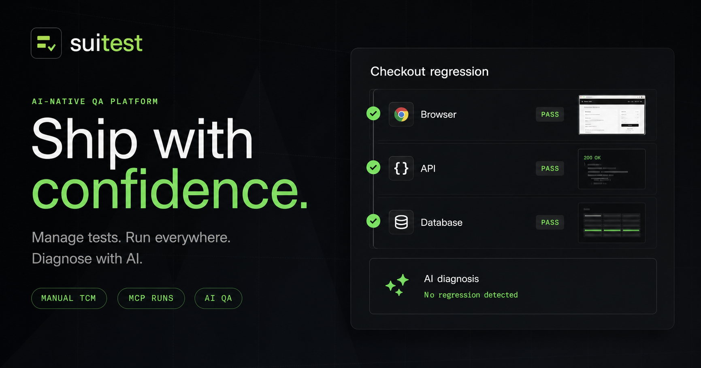

<p align="right"><a href="./README.md">🇬🇧 English</a></p>

# Suitest — Platform Testing yang Bekerja untuk Semua Orang

<p align="center">
  <picture>
    <source media="(prefers-color-scheme: dark)" srcset="assets/brand/logo-dark.svg">
    
  </picture>
</p>

<p align="center">
  <strong>Kelola test case. Jalankan otomatis. Analisa dengan AI.<br>Data tetap milikmu — tanpa biaya langganan.</strong>
</p>

<p align="center">
  <a href="https://github.com/suiflex/suitest/actions/workflows/ci.yml"></a>
  <a href="./LICENSE"></a>
  <a href="https://modelcontextprotocol.io"></a>
</p>

<p align="center">
  <a href="https://www.npmjs.com/package/@suiflex/suitest"></a>
  <a href="https://www.npmjs.com/package/@suiflex/suitest-mcp"></a>
  <a href="https://www.npmjs.com/package/@suiflex/suitest-sdk"></a>
  <a href="https://pypi.org/project/suiflex-suitest-sdk/"></a>
</p>

<p align="center">
  
</p>

---

## Apa itu Suitest?

**Suitest** adalah platform pengujian (testing) gratis yang bisa kamu pasang di komputer atau server sendiri.

**Bayangkan ini:** Kamu punya website atau aplikasi. Kamu ingin memastikan semua fiturnya berjalan benar — tombol bisa diklik, form bisa diisi, data tersimpan dengan baik. Dulu, kamu harus pakai Excel untuk catat test case, lalu jalankan test satu per satu secara manual. **Suitest menggantikan semua itu dalam satu aplikasi.**

### Apa yang bisa dilakukan Suitest?

| Kebutuhanmu | Solusi Suitest |
|-------------|----------------|
| 📝 Catat semua test case di satu tempat | ✅ **Test Case Management** — buat, edit, organisir test case dan suite |
| 🤖 Jalankan test otomatis | ✅ **Automated Runner** — test browser, API, database secara otomatis |
| 📸 Dapat bukti screenshot & video | ✅ **Evidence Capture** — setiap test hasilkan screenshot dan video |
| 🐛 Lacak bug dari test yang gagal | ✅ **Defect Tracking** — bug otomatis tercatat saat test gagal |
| 📊 Lihat laporan hasil testing | ✅ **Dashboard & Analytics** — pass rate, coverage, readiness dalam satu halaman |
| 🔗 Kaitkan requirement ↔ test ↔ bug | ✅ **Traceability** — setiap test terhubung ke requirement dan bug |
| 🔌 Integrasi CI/CD | ✅ **Webhook** — GitHub, GitLab, Jira, Slack |
| 🤖 Pakai AI untuk generate test | ✅ **AI (opsional)** — generate test dari PRD, diagnosis otomatis |

### Siapa yang pakai Suitest?

| Profil | Kebutuhan | Tier yang cocok |
|--------|-----------|-----------------|
| 👩‍💻 **QA Engineer** | Kelola test case, jalankan otomatis, track defect | **ZERO** (gratis) atau **CLOUD** (pakai AI) |
| 👨‍💻 **Developer** | Pastikan PR aman sebelum merge, test cross-cutting | **CLOUD** (untuk CI pipeline) |
| 📋 **Product Manager** | Lihat kesiapan release sebelum deploy | **ZERO** atau **CLOUD** (viewer) |
| 🏦 **IT/Infrastructure** | Self-host untuk compliance (bank, healthcare, government) | **ZERO** → **LOCAL** (Ollama on-prem) |
| 🚀 **Startup / Indie Dev** | Gratis, tidak ada biaya langganan, tidak vendor lock-in | **ZERO** (selamanya) atau **CLOUD** (spot-use) |

---

## Mengapa harus pakai Suitest?

### vs TestRail / Zephyr
TestRail berbayar ($30/user/bulan) dan tidak punya automated runner. **Suitest ZERO sudah punya semua fitur TestRail + automated runner + MCP plugins — gratis.**

### vs Playwright (standalone)
Playwright cuma bisa test browser. **Suitest pakai Playwright sebagai salah satu plugin** + tambah TCM layer + traceability + multi-target (bukan cuma browser).

### vs TestSprite
TestSprite vendor lock-in (LLM mereka, cloud mereka). **Suitest: BYO LLM, self-host, universal MCP plugin (test API/DB/Infra/Mobile, bukan cuma browser).**

---

## Mulai dalam 3 Langkah

### ⚡ Langkah 1: Install (1 menit)

**Yang dibutuhkan:**
- [Node.js](https://nodejs.org/) versi 18 atau lebih tinggi (unduh dari nodejs.org)
- [uv](https://docs.astral.sh/uv/) — package manager Python (install dengan: `pip install uv`)

**Cara cek apakah sudah terinstall:**

Buka terminal (Command Prompt / PowerShell / Terminal) dan ketik:

```bash
node --version    # harus v18 atau lebih tinggi
uv --version      # harus terinstall
```

**Install Suitest:**

```bash
npx @suiflex/suitest onboard
```

> 💡 **Apa itu `npx`?** Ini adalah bagian dari Node.js yang memungkinkan kamu menjalankan program tanpa install manual. `npx @suiflex/suitest onboard` akan mengunduh dan menjalankan Suitest otomatis.

### ⚡ Langkah 2: Buka Dashboard (30 detik)

Setelah install selesai, Suitest akan memberikan alamat web (biasanya `http://localhost:4000`). Buka alamat tersebut di browser.

**Login pertama kali:**
- Email: yang kamu masukkan saat onboard
- Password: yang kamu masukkan saat onboard

> 💡 **Tip:** Jika lupa password, jalankan `suitest settings` di terminal untuk generate ulang API key.

### ⚡ Langkah 3: Buat Test Case Pertama

1. **Login** ke dashboard
2. Klik **"+ New Project"** → beri nama project
3. Klik **"+ New Suite"** → beri nama suite (kumpulan test case)
4. Klik **"+ New Case"** → buat test case pertama
5. Tambahkan **steps** — setiap step punya action (klik tombol, isi form, dll)
6. Klik **"Run"** → test akan dijalankan otomatis

> 💡 **Baru pertama kali?** Lihat [demo interaktif](http://localhost:3000) setelah menjalankan `make demo` — sudah ada test case siap pakai.

---

## Cara Install (Detail)

### 1. 🏠 Install Lokal — Satu Command (Recommended untuk Pemula)

```bash
npx @suiflex/suitest onboard
```

**Yang dilakukan command ini:**

Mengunduh dan menginstall semua komponen yang dibutuhkan.

**Mengelola Suitest setelah install:**

| Mau ngapain? | Command |
|--------------|---------|
| Mulai Suitest | `suitest up` |
| Hentikan Suitest | `suitest down` |
| Generate/refresh API key | `suitest settings` |
| Ganti port | `suitest onboard --port 5000` |

### 2. 🌐 MCP Server Saja (Tanpa Install Platform)

Jika kamu hanya butuh MCP server untuk IDE (Claude Code, Cursor, Codex):

```bash
npx -y @suiflex/suitest-mcp
```

> 💡 **Apa itu MCP?** MCP (Model Context Protocol) adalah standar yang memungkinkan AI agent (seperti Claude Code) menjalankan test. Dengan MCP server, kamu bisa generate test dari repo code kamu.

**Contoh konfigurasi untuk Claude Code / Cursor (`.mcp.json`):**

```json
{
  "mcpServers": {
    "suitest": {
      "command": "npx",
      "args": ["-y", "@suiflex/suitest-mcp"],
      "env": {
        "SUITEST_API_URL": "http://localhost:4000",
        "SUITEST_API_KEY": "sk_suitest_..."
      }
    }
  }
}
```

> 💡 **`SUITEST_API_URL` dan `SUITEST_API_KEY` opsional.** Tanpa mereka, hasil tetap tersimpan lokal di folder `suitest-output/`.

### 3. 🐳 Full Platform — Docker Compose

Jika kamu ingin menjalankan semua komponen (API, web, runner, database, Redis, MinIO):

```bash
git clone https://github.com/suiflex/suitest && cd suitest
cp .env.example .env
```

**Edit `.env`** — isi super-admin:

```bash
SUITEST_AUTH_SECRET=<32-char-random-hex>     # generate: openssl rand -hex 32
SUITEST_SUPERADMIN_EMAIL=admin@example.com
SUITEST_SUPERADMIN_PASSWORD=<strong-password>
```

**Jalankan:**

```bash
make docker-up            # pull images dan boot stack
open http://localhost:3000
```

> 💡 **Apa itu Docker Compose?** Docker adalah cara menjalankan aplikasi dalam "container" (wadah terisolasi). Docker Compose memudahkan menjalankan banyak container sekaligus. Jika belum punya Docker, install dari [docker.com](https://docker.com).

### 4. ☸️ Kubernetes — Helm

Untuk deployment di Kubernetes cluster:

```bash
helm install suitest infra/helm/suitest -f infra/helm/suitest/values.yaml
```

> 💡 **Butuh:** cluster Kubernetes + Helm + PostgreSQL/Redis/object storage sebagai external services.

### 5. 🔧 Local Development (Developer)

Jika kamu ingin contribute ke Suitest:

```bash
# Butuh: Python 3.12 + uv, Node 20 + pnpm, PostgreSQL/Redis/MinIO
make setup     # copy .env → install deps → run migrations → seed DB
make dev       # start API (:4000) + web (:3000) + runner bersamaan
```

**Command berguna lainnya:**

| Command | Fungsi |
|---------|--------|
| `make dev-api` | Start API saja |
| `make dev-web` | Start web saja |
| `make dev-runner` | Start runner saja |
| `make migrate` | Jalankan database migration |
| `make seed` | Isi data demo |
| `make ci` | Lint + typecheck + test (sama seperti CI) |
| `make help` | Lihat semua command |

---

## Tier: ZERO, LOCAL, CLOUD

Suitest punya 3 level kemampuan. **Kamu tidak perlu LLM untuk menggunakan Suitest.**

### 🟢 ZERO — Gratis, Tanpa AI

**Trigger:** Tidak ada LLM yang dikonfigurasi (default)

**Yang kamu dapat:**
- ✅ Full Test Case Management (manual)
- ✅ Automated Runner via MCP (Playwright, API, Postgres, dll)
- ✅ Live run logs via WebSocket
- ✅ Screenshot & video evidence
- ✅ Rule-based defect tracking
- ✅ Traceability matrix
- ✅ Analytics dashboard
- ✅ CI/CD webhooks (GitHub, GitLab, Jira, Slack)
- ✅ Deterministic generators (OpenAPI, Browser Recorder, URL Crawler)
- ✅ Blackbox DOM engine (test web app dari URL saja)

> 💡 **Tier ini sudah sangat powerful.** Bisa menggantikan TestRail + Playwright dalam satu platform.

### 🟡 LOCAL — AI di Hardware Sendiri

**Trigger:** Konfigurasi LLM = Ollama / llama.cpp / vLM / LM Studio

**Yang ditambahkan:**
- ✅ AI test generation (dari PRD, URL, atau MCP discovery)
- ✅ AI failure diagnosis (auto-kategorikan: FLAKE / REGRESSION / ENVIRONMENT / TEST_BUG)
- ✅ Conversational testing (chat dengan AI untuk generate test)
- ✅ Air-gapped friendly (tanpa internet)

### 🔵 CLOUD — AI via Cloud Provider

**Trigger:** Konfigurasi LLM = Anthropic / OpenAI / Gemini / Groq / OpenRouter / dll

**Yang ditambahkan:**
- ✅ Semua fitur LOCAL
- ✅ 100+ LLM providers via LiteLLM
- ✅ Cost tracking + budget guard
- ✅ Custom OpenAI-compatible base URL (gateways, routers, proxies)

> 💡 **Tier LOCAL dan CLOUD diaktifkan dari web UI: Settings → LLM.** Tidak perlu edit file env.

---

## Test Case Pertama (Tanpa AI)

Dari install kosong, kamu bisa bootstrap dan menjalankan test browser nyata:

1. **Login** (super-admin email/password)
2. **Buat project dan suite** — Test Cases screen akan pandu kamu
3. **Buat test case** — "New case", tambahkan steps. Step menarget MCP provider (misal `playwright-mcp`)
4. **Klik "Run"** — runner akan menjalankan setiap step via MCP (Playwright mengendalikan browser nyata)
5. **Lihat hasil** — run detail page menampilkan status LIVE → PASS/FAIL
6. **Triage** — test gagal otomatis buat defect; mark suite sebagai "gating" untuk block deploy

> 💡 **Seluruh perjalanan ini diuji dengan Playwright suite nyata** — `make e2e-real`

---

## Aktifkan AI (Opsional)

LLM dikonfigurasi **per workspace dari web UI** — `Settings → LLM` — bukan dari env vars.

**Cara mengaktifkan:**
1. Buka **Settings → LLM**
2. Pilih provider (Anthropic, OpenAI, Gemini, Groq, Ollama, dll)
3. Masukkan API key (akan di-encrypt AES-GCM, tidak ditampilkan lagi)
4. Workspace tier otomatis naik (ZERO → CLOUD/LOCAL)

**Provider yang didukung:**

| Tier | Provider |
|------|----------|
| **CLOUD** | Anthropic, OpenAI, Gemini, Groq, OpenRouter, DeepSeek, dll (100+ via LiteLLM) |
| **LOCAL** | Ollama, llama.cpp, vLM, LM Studio |
| **Custom** | URL OpenAI-compatible (gateways, routers, proxies) |

> 💡 **Default selalu ZERO.** Tidak ada LLM call yang dibuat sampai workspace mengkonfigurasi provider.

---

## Repository Structure

```
suitest/
├── README.md                ← kamu di sini
├── CLAUDE.md                ← aturan coding untuk AI agent
├── Makefile                 ← semua dev command (make help)
│
├── apps/
│   ├── web/                 ← Frontend (Vite + React 19)
│   ├── api/                 ← Backend (FastAPI Python)
│   └── runner/              ← Worker yang menjalankan test via MCP
│
├── packages/
│   ├── agent/               ← AI agent (LiteLLM + LangGraph)
│   ├── db/                  ← Database (SQLAlchemy + Alembic)
│   ├── mcp/                 ← MCP client + registry + bundled providers
│   ├── lifecycle/           ← MCP server: analyze→generate→run→publish
│   ├── mcp-npx/             ← @suiflex/suitest-mcp (npm launcher)
│   ├── suitest-npx/         ← @suiflex/suitest (one-command launcher)
│   ├── shared/              ← Shared Pydantic schemas
│   └── core/                ← Capability resolver, autonomy, crypto
│
├── sdk/
│   ├── python/              ← Python SDK (REST client)
│   └── typescript/          ← TypeScript SDK
│
├── infra/
│   ├── docker/              ← Dockerfile per service
│   └── helm/suitest/        ← Helm chart
│
└── docs/                    ← Dokumentasi lengkap
```

---

## Dokumentasi

**Mulai dari [docs/ROADMAP.md](./docs/ROADMAP.md)** — single entry point untuk semua fitur.

| Dokumen | Topik | Untuk siapa? |
|---------|-------|-------------|
| [ROADMAP.md](./docs/ROADMAP.md) | Milestones M0 → M15 + build status | Developer yang mau contribute |
| [PRODUCT.md](./docs/PRODUCT.md) | Vision, personas, user journeys | Product Manager, QA Lead |
| [ARCHITECTURE.md](./docs/ARCHITECTURE.md) | Stack, services, topology | Developer, DevOps |
| [DATA_MODEL.md](./docs/DATA_MODEL.md) | Database schema + entity diagram | Backend Developer |
| [API.md](./docs/API.md) | REST + WebSocket contract | Frontend Developer, API Consumer |
| [UI_SPEC.md](./docs/UI_SPEC.md) | Per-screen component spec | Frontend Developer, Designer |
| [CAPABILITY_TIERS.md](./docs/CAPABILITY_TIERS.md) | ZERO/LOCAL/CLOUD gating | Semua (penting untuk memahami fitur) |
| [MCP_PLUGINS.md](./docs/MCP_PLUGINS.md) | MCP registry + routing + security | Developer, DevOps |
| [GENERATORS.md](./docs/GENERATORS.md) | Generator design (deterministic + LLM) | QA Engineer, Developer |
| [AUTONOMY.md](./docs/AUTONOMY.md) | Per-workspace autonomy dial | Admin, QA Lead |
| [AI_AGENT.md](./docs/AI_AGENT.md) | Prompts + LangGraph + tool registry | AI/ML Engineer |
| [BLACKBOX_UI_TESTING.md](./docs/BLACKBOX_UI_TESTING.md) | Blackbox DOM engine | QA Engineer (test dari URL saja) |
| [DESKTOP_TESTING.md](./docs/DESKTOP_TESTING.md) | Desktop targets (computer-use, Electron, Slint) | QA Engineer (test desktop app) |
| [DEPLOYMENT.md](./docs/DEPLOYMENT.md) | Compose / Helm / air-gapped | DevOps, SRE |
| [TROUBLESHOOTING.md](./docs/TROUBLESHOOTING.md) | FAQ teknis & solve masalah umum | Semua |

---

## FAQ (Pertanyaan Umum)

### ❓ Apakah Suitest gratis?
**Ya.** Suitest open-source (Apache 2.0 License). Tidak ada biaya langganan. Kamu bisa self-host tanpa batas.

### ❓ Apakah saya harus bisa coding untuk pakai Suitest?
**Tidak.** Suitest ZERO (default) bisa dipakai 100% tanpa coding. Kamu cukup buat test case melalui web dashboard, dan runner akan menjalankan test secara otomatis.

### ❓ Apakah saya butuh AI/LLM untuk pakai Suitest?
**Tidak.** ZERO tier berfungsi penuh tanpa AI. AI hanya menambah fitur seperti generate test dari PRD, diagnosis otomatis, dan conversational testing.

### ❓ Bagaimana cara install Suitest?
Lihat [Mulai dalam 3 Langkah](#mulai-dalam-3-langkah) di atas. Cukup satu command: `npx @suiflex/suitest onboard`

### ❓ Apakah data saya aman?
**Ya.** Suitest self-host — data tidak pernah keluar dari server kamu. API key di-encrypt AES-GCM. Tidak ada telemetry wajib.

### ❓ Apakah Suitest bisa test selain browser?
**Ya.** Suitest bisa test: browser (Playwright), API (HTTP/GraphQL/gRPC), database (Postgres/Mongo/MySQL), mobile (Appium), desktop (Slint, Tauri), infra (Kubernetes), dan MCP server lainnya.

### ❓ Bagaimana jika saya stuck / ada error?
Lihat [docs/TROUBLESHOOTING.md](./docs/TROUBLESHOOTING.md) atau buka issue di [GitHub Issues](https://github.com/suiflex/suitest/issues).

### ❓ Bagaimana cara contribute?
Baca [CONTRIBUTING.md](./CONTRIBUTING.md). Singkatnya:
1. Baca [CLAUDE.md](./CLAUDE.md) — aturan coding
2. Pick item di [ROADMAP.md](./docs/ROADMAP.md) yang belum selesai
3. Branch: `feat/<scope>-<short-desc>`
4. Commit: conventional commits (`feat(api): ...`)
5. Pastikan `make ci` pass sebelum push

### ❓ Apakah ada demo yang bisa saya coba?
**Ya.** Jalankan `make demo` → buka `http://localhost:3000` → login `demo@suitest.dev` / `demo1234`

### ❓ Port 4000 sudah dipakai, bagaimana?
Gunakan flag `--port`: `npx @suiflex/suitest onboard --port 5000`

### ❓ Apakah Suitest bisa dijalankan di Windows?
**Ya.** Suitest mendukung Windows, macOS, dan Linux. Pastikan Node.js ≥ 18 dan uv terinstall.

---

## Perbandingan dengan Tools Lain

| Fitur | TestRail | Playwright | TestSprite | **Suitest ZERO** | **Suitest CLOUD** |
|-------|:--------:|:----------:|:----------:|:----------------:|:-----------------:|
| Manual Test Case Management | ✅ | ❌ | Partial | ✅ | ✅ |
| Automated Runner | ❌ | ✅ | ✅ | ✅ | ✅ |
| Universal MCP Plugin Layer | ❌ | ❌ | Partial | ✅ | ✅ |
| AI Generation / Diagnosis | ❌ | ❌ | ✅ | ❌ | ✅ |
| Self-host | ✅ | ✅ | ❌ | ✅ | ✅ |
| BYO LLM (100+ providers) | n/a | n/a | ❌ Locked | n/a | ✅ |
| Air-gapped | ✅ | ✅ | ❌ | ✅ | ✅ (Ollama) |
| Open Source | ❌ | Runner only | ❌ | ✅ | ✅ |

---

## Release Notes

Suitest ships sebagai dua package independen:

| Package | Fungsi | Update dengan |
|---------|--------|---------------|
| [`@suiflex/suitest`](https://www.npmjs.com/package/@suiflex/suitest) (launcher) | Platform lokal: web dashboard + semua Python wheels | `npx @suiflex/suitest@latest onboard` |
| [`@suiflex/suitest-mcp`](https://www.npmjs.com/package/@suiflex/suitest-mcp) (MCP server) | IDE tools + lifecycle engine | `npx -y @suiflex/suitest-mcp@latest` |

**Release notes:** [suitest.suiflex.dev/docs/changelog](https://suitest.suiflex.dev/docs/changelog/)

---

## Contributing

1. **Baca [CLAUDE.md](./CLAUDE.md)** — aturan coding yang berlaku (termasuk untuk AI coding agent)
2. **Pick item berikutnya di [docs/ROADMAP.md](./docs/ROADMAP.md)** — satu PR = satu acceptance criterion
3. **Branch:** `feat/<scope>-<short-desc>`. **Commits:** conventional commits (`feat(api): ...`)
4. **Sebelum push:** `make ci` harus pass (ruff + mypy strict, tsc strict + ESLint, pytest async + vitest)

Lihat juga [CONTRIBUTING.md](./CONTRIBUTING.md), [CODE_OF_CONDUCT.md](./CODE_OF_CONDUCT.md), dan [SECURITY.md](./SECURITY.md).

---

## License

Apache License 2.0. See [LICENSE](./LICENSE).

## Acknowledgments

Built on [Model Context Protocol](https://modelcontextprotocol.io) (Anthropic), [LiteLLM](https://github.com/BerriAI/litellm) (BerriAI), [LangGraph](https://langchain-ai.github.io/langgraph/) (LangChain), [`@ai-sdk/react`](https://sdk.vercel.ai/docs) + assistant-ui (Vercel), shadcn/ui, TanStack, and the FastAPI / SQLAlchemy / Pydantic ecosystems.

---

<p align="center">
  <a href="https://suiflex.dev">
    
  </a>
</p>
<p align="center">
  <sub><strong>Suitest</strong> is a <a href="https://suiflex.dev">Suiflex</a> project — powered by Suiflex.</sub>
</p>
